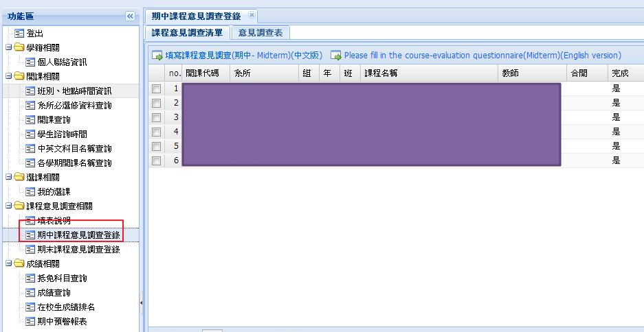

# NTNU Course Quesionaire AutoFill in Middle

Just using javascript to autofill the quesionaire in NTNU.

You must open page in this view.

-

You can excute the program by typing this 
code in browser's developer tool or 
take this code into browser's bookmark,then click it.